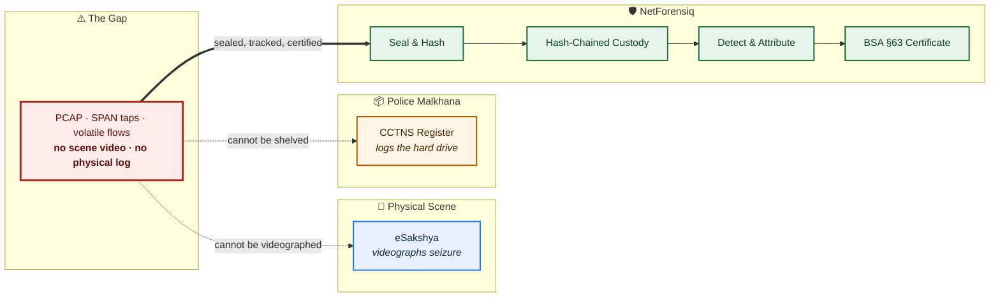
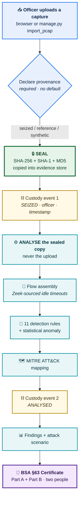
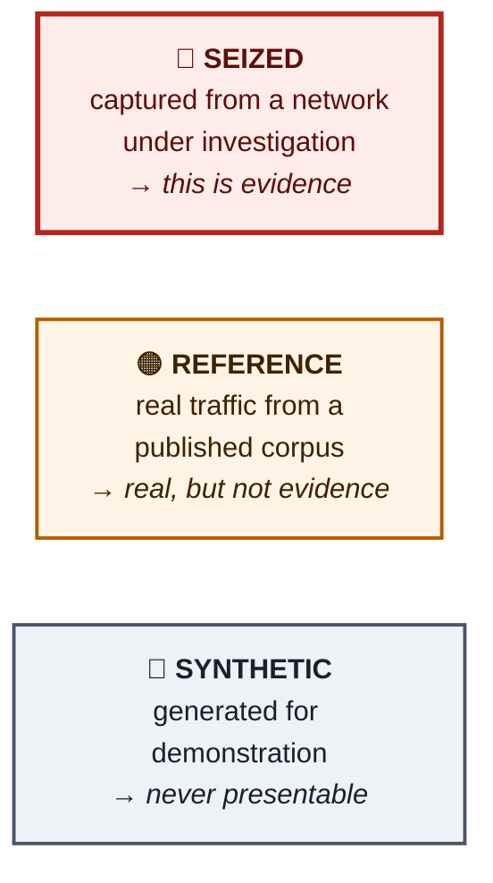
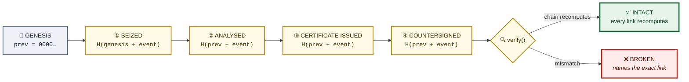
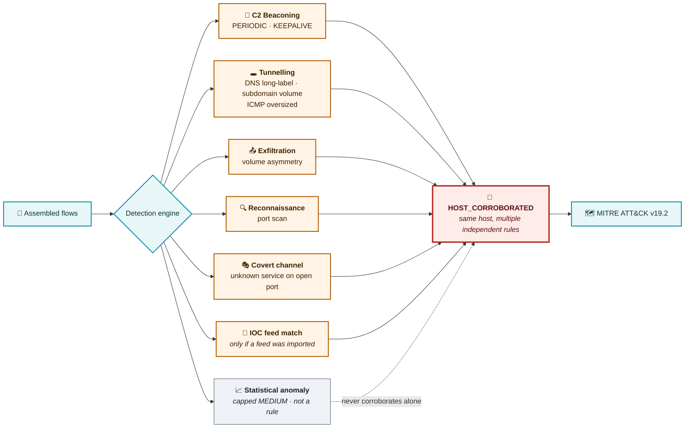
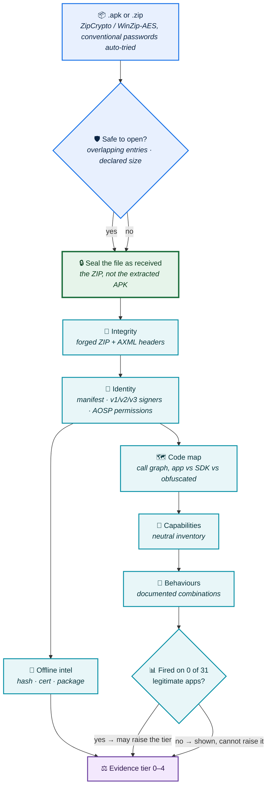
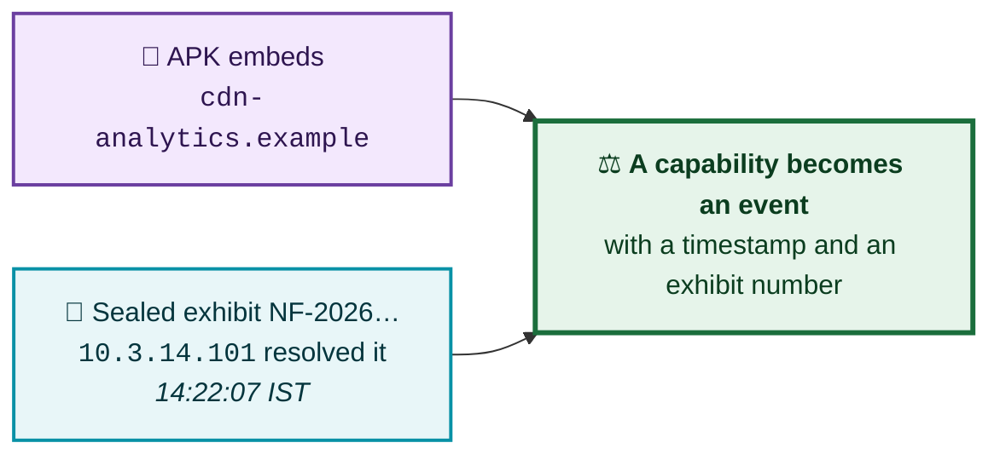
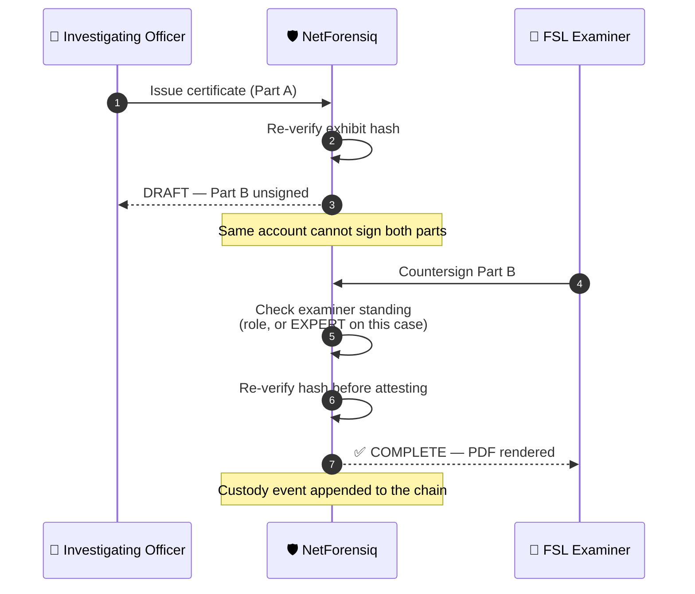
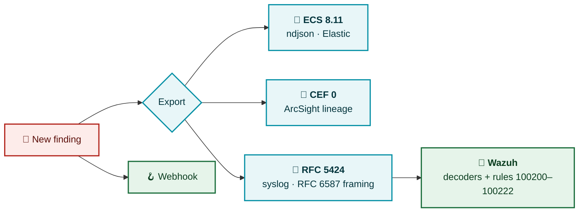
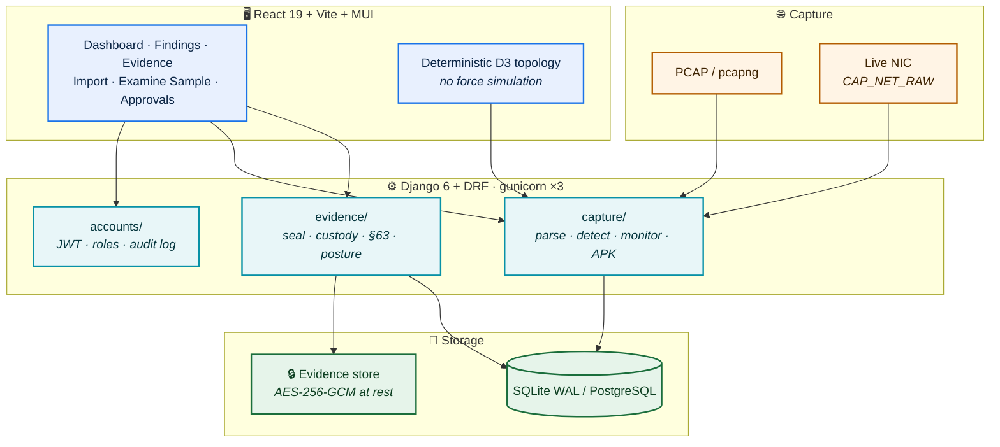

<div align="center">

# 🛡️ NetForensiq

### Network & Packet Forensics Platform — built to survive a courtroom, not just a dashboard

[](https://python.org)
[](https://djangoproject.com)
[](https://react.dev)
[](https://scapy.net)
[](https://docker.com)
[](#-tests)
[](#-air-gapped-by-construction)
[](#-bsa-section-63-certificates)

**🥈 2nd Place — KANAD S.H.I.E.L.D. 2026**
Cyber Crime Branch, Ahmedabad City Police × i-Hub Gujarat
*Category 2 · Problem Statement #8 — Network & Packet Forensics Platform*

</div>

---

## 🎯 The Problem

Arkime, Zeek and Suricata will show you packets. **None of them will hand an investigating officer a document a magistrate can accept.**

Indian digital evidence lives or dies on the **Bharatiya Sakshya Adhiniyam (BSA) 2023, Section 63**. Physical seizure already has its rails — eSakshya videographs the scene, CCTNS logs the hard drive into the malkhana. Network evidence falls straight through the gap between them.



> **NetForensiq is not another packet analyser.** It is the *legal admissibility and chain-of-custody layer* for network evidence.

---

## ⚡ Quick Start

```bash
git clone https://github.com/Anbu-00001/NetForensiq.git
cd NetForensiq

docker build -t netforensiq:latest .

docker run -d --name netforensiq --restart unless-stopped \
  --cap-add=NET_RAW --cap-add=NET_ADMIN \
  -p 127.0.0.1:8000:8000 \
  -v netforensiq_db:/app/data \
  -v netforensiq_evidence:/app/evidence_store \
  -e SECRET_KEY="change-me-before-real-use" \
  -e ALLOWED_HOSTS=127.0.0.1,localhost \
  -e SQLITE_NAME=/app/data/netforensiq.sqlite3 \
  netforensiq:latest
```

Open **http://127.0.0.1:8000** · seed the demo data with:

```bash
docker exec netforensiq python manage.py seed_demo
```

| Account | Role | Can do |
|---|---|---|
| `investigator` | Investigator | Import captures, triage findings, seal exhibits, sign Part A |
| `expert` | FSL / Examiner | **Countersign Part B**, examine APK samples |
| `commander` | Administrator | Approve accounts, read the sign-in log, examine samples |
| `viewer` | Viewer | Read-only |

<sub>Demo password for all four: `Netforensiq@2026`. `pending-applicant` fails by design — it demonstrates the approval gate.</sub>

> ⚠️ Bound to **loopback**, not `0.0.0.0`. A forensic tool that appears on the station LAN the moment it starts is not a decision anyone made.

---

## 🔄 The Evidence Lifecycle

Everything in NetForensiq flows through one pipeline. **The hash is taken before anything reads the file** — so the artefact the digest describes is the artefact the findings came from.



### Why provenance has no default

A default would mean the system deciding, on an officer's behalf, **what a file is** — and the only safe default makes the feature useless. Three declarations, each printed on the certificate:



---

## ⛓️ Chain of Custody — Hash-Chained, Not Just Logged

An audit table anyone can `UPDATE` is not a chain of custody. Every custody event carries the hash of the one before it, so **removing or editing any link breaks every link after it**.



Tampering is reported as *"the chain breaks at event 3"* — not a silent boolean.

---

## 🎯 Detection Engine

Eleven rules, every one **deterministic and citable**. No black-box score decides whether someone is prosecuted.



| Rule ID | Detects | Threshold source |
|---|---|---|
| `C2_BEACON_PERIODIC` | Regular callback intervals | Published, with interval statistics shown |
| `C2_BEACON_KEEPALIVE` | Long-lived low-byte channels | Published |
| `DNS_TUNNEL_LONG_LABEL` | Oversized DNS labels | RFC 1035 label limits |
| `DNS_TUNNEL_SUBDOMAIN_VOLUME` | High unique-subdomain counts | Published |
| `ICMP_TUNNEL_OVERSIZED` | ICMP payloads carrying data | Published |
| `EXFIL_VOLUME_ASYMMETRY` | Outbound ≫ inbound | Published + entropy sample count |
| `RECON_PORT_SCAN` | Fan-out across ports | Published |
| `COVERT_CHANNEL_UNKNOWN_PORT` | Unrecognised service on a permitted port | Published |
| `IOC_FEED_MATCH` | Endpoint on an imported feed | Feed's own retrieval date |
| `HOST_CORROBORATED` | One host implicated by **several independent rules** | Derived |
| `ANOMALY_STATISTICAL` | Unsupervised outlier | ⚠️ Cites nothing — capped MEDIUM by design |

> Every threshold is served live at `GET /api/detections/thresholds/` — **35 thresholds**, each tagged as sourced or heuristic. A number an officer cannot decompose is a number they cannot testify to.

---

## 📱 APK Examination — evidence tiers, not a score

Submitted samples are sealed like any other exhibit, then examined **statically** — never executed, never sent to a cloud scanner. The examination runs as a **separate, memory-limited process**: androguard and apkInspector (Apache-2.0) never share an address space with scapy (GPL-2.0-only), and a sample built to crash a parser takes down a worker, not the server.



| Tier | Means | Needs |
|---|---|---|
| **4** Known harmful software | The file or its signing key is a listed harmful product | Hash or certificate match in a bundled indicator set |
| **3** Harmful behaviour demonstrated | A documented malware technique is in the app's own code | A validated behaviour rule, with the call path shown |
| **2** Built to evade inspection | Constructed to defeat analysis tools or hide from the user | A validated integrity indicator |
| **1** No harmful behaviour established | Examination completed; nothing above was found | — **never means "safe"** |
| **0** Could not be examined | Parsing, memory or time ran out | — never presented as a clean result |

### The rule that keeps it honest

**A signal may only raise a tier if it fired on _zero_ apps in the legitimate reference corpus.** Everything else is reported with its count and cannot move the verdict. The corpus is deliberately adversarial: F-Droid apps that legitimately install packages (F-Droid, Droid-ify, Aurora Store), create VPNs (NetGuard, RethinkDNS, AdAway, OpenVPN), handle SMS (Fossify Messages), automate through accessibility (Key Mapper) and run shell commands (Termux), plus a Play Store build of Flipkart pulled from a phone.

Measured on that corpus (`backend/apk_engine/data/baselines.json`, regenerate with `python -m apk_engine evaluate`):

| Signal | Legitimate apps | Malicious sample | Verdict effect |
|---|---|---|---|
| Installs packages | **13 / 31** | yes | capability only |
| Creates a VPN interface | **4 / 31** | yes | capability only |
| **Installs a package while routing all traffic into its own VPN** | **0 / 31** | yes | **raises to tier 3** |
| Forged ZIP / AXML headers | **0 / 31** | yes | raises to tier 2 |
| Disables its own launcher icon | **1 / 31** | no | reported, cannot raise |

The judge's sample from KANAD S.H.I.E.L.D. 2026 (`com.mrram.loader`, delivered as "PENSION CARD VERIFICATION") reaches **tier 3 — Hostile downloader**, on its own `MainActivity` feeding a `PackageInstaller` session while `InstallVpnService` routes `0.0.0.0/0` and `::/0` into a local VPN, plus a Cloudflare quick-tunnel stage-2 URL and five forged-header indicators. Flipkart reaches **tier 1**. Under the previous additive score it was the other way round: Flipkart scored 100/100 "Remote access trojan", on a root *check* inside NPCI's UPI library.

### Two design decisions worth reading

**① Capability is not intent.** Google Play explicitly permits SMS permissions for UPI apps, and a banking SDK is *expected* to check for root. So permissions and API calls are an inventory, and only combinations that published threat research documents — each citing that report, listing the legitimate apps that look similar, and mapping to MITRE ATT&CK — can establish harm.

**② Whose code is it?** A finding names the calling class, attributed to the app, to a named SDK (Exodus signatures) or to obfuscated code. A capability that exists only inside a bundled library is counted separately and never feeds a behaviour rule.

### The correlation nobody else can produce



---

## 📜 BSA Section 63 Certificates

Section 63(4) requires **the person in charge of the device and an expert** — two different people. A two-part form that one account can sign twice guarantees nothing.



The renderer reproduces **THE SCHEDULE** to the Act — Part A and Part B — and the custody register prints its signature column **empty**, because a signature this system never witnessed is not one it will print.

---

## ⚡ Performance

Measured on a real **200 MB / 2,274,747-packet** ICS capture (4SICS Geek Lounge):

| Stage | Before | After | Gain |
|---|---:|---:|---:|
| Packet parse + flow assembly | 377.8 s | **34.0 s** | **11.1×** |
| Browser upload → sealed → analysed | 11 m 55 s | **3 m 12 s** | **3.7×** |
| Graph aggregation endpoint (117k flows) | 34.03 s | **1.28 s** | **27×** |

The parse win comes from `capture/fastparse.py`, which reads header fields straight out of the frame with `struct` instead of building a Scapy object per packet.

**Equivalence is tested, not assumed.** `tests_fastparse.py` runs both readers over real captures and requires *identical* flows, DNS records, byte counts and timestamps. It found two genuine defects the fast path would otherwise have introduced:

- One frame in 2,274,747 declared a TCP `dataofs` of 0 — malformed, and the dissector keeps it. Refusing it lost 1 packet, 1 flow and 62 bytes.
- UDP payloads must **not** be clamped to the length field, because the dissector folds trailing bytes into `Padding` and returns them.

---

## 🔌 SIEM & Alerting



`integrations/wazuh/` ships decoders, a ruleset and `sample-events.log` so the pipeline can be proved with `wazuh-logtest` **before** NetForensiq is running. The test suite parses the shipped XML and runs its regex against live `to_syslog` output — a decoder drifted from its emitter installs cleanly, matches nothing, and reports zero alerts, which is indistinguishable from a quiet network.

> **Honest framing:** syslog is a real integration. The webhook and pull API are *export in an ingestible format*. A SOC engineer knows the difference, so the compliance doc states it.

---

## 🏗️ Architecture



**Why the topology graph is deterministic:** a force simulation draws the same capture differently every time it runs. Reproducibility is an evidence property, so the layout is a two-column ledger — inside the monitored network on the left, outside on the right, arrowheads pointing at whoever answered.

---

## ✈️ Air-Gapped by Construction

The running container needs **no network**. Verified under `--network none`: a socket to `1.1.1.1` fails with *Network is unreachable*, and the platform still seals a capture, analyses it and issues a §63 certificate.

- 🚫 No cloud scanner, no VirusTotal, no telemetry
- 🔑 Raw-socket capability baked into the image, not applied by hand
- 📦 `scripts/save_airgap_images.sh` / `load_airgap_images.sh` for transfer
- 🗄️ SQLite WAL + 30 s busy timeout, so long analyses don't lock out sign-in

<sub>Building requires a network. The build happens on a connected machine and the image is carried across.</sub>

---

## 🧪 Tests

```bash
docker exec netforensiq python manage.py test    # 513 backend tests
cd frontend && npx playwright test               # Playwright E2E
```

<div align="center">

**`Ran 447 tests — OK`**

</div>

The tests that earned their keep:

| Test | Defect it caught |
|---|---|
| `tests_wazuh.py` | Shipped XML was **malformed** — `--` inside a comment. Wazuh would have loaded nothing, silently. |
| `tests_fastparse.py` | Two byte-level divergences between the fast and reference parsers. |
| `HomeNetIsDescribedAsApplied` | Graph caption described the deployment default while classification used a `/32`. |
| `tests_monitor.py` | Module-level state broke under 3 gunicorn workers — `start` and `status` hit different processes. |
| `apk_engine/tests/test_cli.py` | An examination that fails must be tier 0. Three failure paths — timeout, killed process, unparsable output — all once returned an empty findings list that read like a clean sample. |
| `apk_engine` corpus run | `cap.overlay_window` matched **nothing at all**, in 31 legitimate apps and the malicious one: window type is assigned to a field, not passed to the constructor. |

---

## 📁 Layout

```
NetForensiq/
├── backend/
│   ├── accounts/          Auth · roles · audit log · sign-in log · approvals
│   ├── capture/
│   │   ├── fastparse.py     struct-based frame reader (11× faster)
│   │   ├── processor.py     flow assembly · TLS/DNS/HTTP decode
│   │   ├── detection.py     11 rules + published threshold registry
│   │   ├── apk_runner.py    runs the examination engine out of process
│   │   ├── monitor.py       DB-backed live monitor (multi-worker safe)
│   │   ├── siem.py          ECS · CEF · RFC 5424
│   │   ├── ioc.py           threat-feed import & matching
│   │   └── scenario.py      ATT&CK-ordered attack reconstruction
│   ├── apk_engine/        APK examination, run as a separate program
│   │   ├── integrity.py     forged ZIP/AXML headers (apkInspector)
│   │   ├── codemap.py       call graph · app vs SDK vs obfuscated code
│   │   ├── behaviours.py    capabilities + documented behaviour rules
│   │   ├── baselines.py     which signals measurement lets move a verdict
│   │   ├── evaluate.py      corpus harness → data/baselines.json
│   │   └── data/            Exodus · stalkerware IOCs · IANA TLDs (dated)
│   └── evidence/
│       ├── service.py       seal · custody · verify · §63 signing
│       ├── certificate_pdf.py   renders THE SCHEDULE, Parts A & B
│       ├── crypto.py        AES-256-GCM at rest
│       └── posture.py       statutory compliance posture
├── frontend/src/pages/    Dashboard · Detections · Evidence · Import · Sample
├── integrations/wazuh/    decoders · rules · sample events
├── research/              legal, technical and literature research
└── scripts/               verification · offline bundle · air-gap transfer
```

---

## ⚠️ Honest Limitations

This project was built for a hackathon and it is **not finished**. Stated plainly, because a forensics tool that oversells itself is worse than none:

- **The APK corpus is small.** Signals are validated against 31 legitimate apps and **one** malicious sample. Zero firings in 31 apps bounds the false-positive rate at ~9%, not at zero, and detection rate is not measured at all. ~300 legitimate apps are needed to claim ≤1%; the harness for that is `python -m apk_engine evaluate`.
- **Static analysis only.** No detonation, no decompilation, no emulation. It reads the manifest, the certificate and DEX strings — nothing more is claimed.
- **Ten of the fourteen ATT&CK tactics cannot be evidenced from network capture at all**, and `scenario.py` names them rather than quietly leaving them out.
- **`ANOMALY_STATISTICAL` cites no threshold.** It is capped at MEDIUM and always ships the features that made a flow stand out.
- **JA4+ variants (JA4S/JA4H/JA4T…) are not shipped** — FoxIO License 1.1 makes them non-commercial. Only core JA4 (BSD-3-Clause) is used.
- **CERT-In's 6-hour rule is a reporting deadline, not a detection mandate**, and is deliberately *not* cited as justification for real-time alerting.

---

## 📄 License

**MIT** — see [LICENSE](LICENSE). Third-party code and bundled reference data, with their licences and retrieval dates, are listed in [THIRD_PARTY_NOTICES.md](THIRD_PARTY_NOTICES.md).

MIT is a deliberate choice, not a default: scapy (GPL-2.0-only) runs in the web process and androguard (Apache-2.0) runs in the APK engine, and those two licences cannot be combined in one program. MIT is compatible with both, and the engine runs as a **separate process** so the question never arises in the first place.

<div align="center">
<sub>Reference captures from Netresec, malware-traffic-analysis.net and WRCCDC are used under their published terms and are marked <b>REFERENCE</b> — real traffic, never evidence.</sub>
</div>
