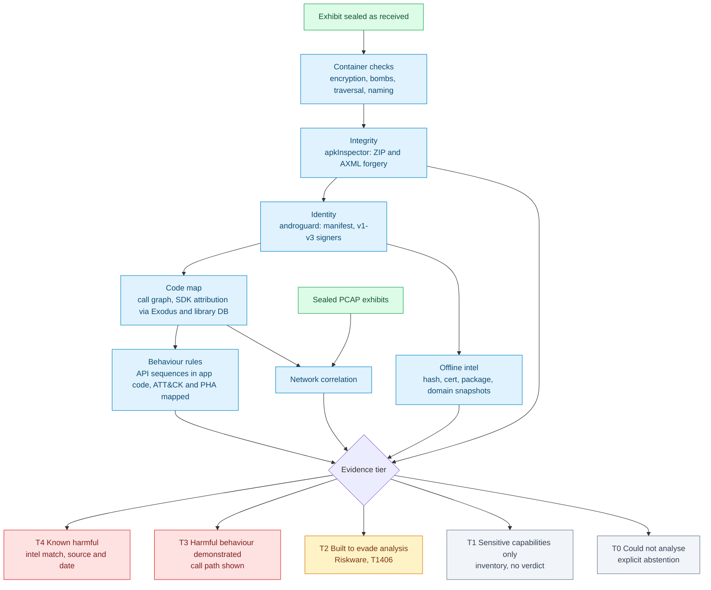

# 150 — APK / ZIP malware classification: why ours is wrong, what the field does, what to build

**Status:** Research, 17 Sep 2026. Tools were run, not just read about; every number below was
measured on this machine unless it carries a citation.
**Verification rule (same as [145](145_METADATA_AND_ENCRYPTED_ANALYSIS.md)):** ✅ means the primary
source (paper PDF, vendor report, source code, official docs) was fetched or cloned and read.
⚠️ means only a secondary source (search summary, news article) was seen. No claim is unmarked.

**Trigger:** a Flipkart APK pulled from a phone (`base.apk`) was reported as 100/100 "highly
suspicious", classified as a Remote Access Trojan. The judge's sample only scored "suspicious"
because our own parser crashed on it.

---

## TL;DR

1. **The current module confuses *capability* with *intent*.** It adds up permissions and DEX
   strings that legitimate apps routinely have: UPI apps may hold SMS permissions under Google Play
   policy, and NPCI's own UPI library inside Flipkart ships root checks. On audited open-source apps it calls
   Key Mapper 100/100 and AdAway a "Dropper + RAT" (§1).
2. **MobSF does not classify malware and never claimed to.** Its "security score" is an appsec
   vulnerability score; its behaviour rules are all `severity: info`; its "top malware permissions"
   list contains `INTERNET` and `VIBRATE` (§2.1). Wrapping MobSF's output as a verdict would
   reproduce exactly the Flipkart failure.
3. **Quark reproduces it too:** it rates Flipkart *and* the dropper "High Risk", with Flipkart
   matching **121** behaviours at 100% confidence against the dropper's **41** (§2.2).
4. **What does separate them is signals that fired on 0 of 31 legitimate apps in our pilot.** Examples:
   deliberate ZIP/manifest tampering, and *combinations* of behaviours documented in real
   campaigns (install a payload while a VPN blackholes the network). Isolated capabilities don't
   (§1.3, §4).
5. **Recommendation:** replace the additive score with **evidence tiers**. Build on `androguard` +
   `apkInspector` (both Apache-2.0, embeddable). Keep GPL tools (APKiD, Quark, MobSF) out of
   process. Label families using Google's PHA taxonomy plus MITRE ATT&CK Mobile. Allow
   "cannot tell" as an answer. Publish a measured false-positive rate or make no accuracy claim (§5–§6).

---

## 1. What is wrong today — measured

### 1.1 The Flipkart false positive, decomposed

`base.apk`, SHA-256 `4663196214d8be157f87da3d73290f49cd3148b5ab72686dd983f956fe602093`,
package `com.flipkart.android`. Current `analyse_apk()` + `classify()`:

| Output | Value | Actual cause (verified in bytecode with androguard xrefs) |
|---|---|---|
| Score | **100 / 100**, "highly suspicious" | Sum of 14 permission weights + 8 DEX strings, no base rate for any of them |
| Family 1 | **Remote access trojan (RAT)**, confidence 0.75 | Required signal "Executes commands or seeks root" = the string `/system/bin/su`. All **4** classes referencing it do so from root-**detection** methods: `isRooted` (`com.flipkart.android.utils.Z1`, `com.flipkart.uploader.utils.b`), `isDeviceRooted` (`com.fkminutes…bridge.o`) and NPCI's UPI PIN library `org.npci.upi.security.pinactivitycomponent.d`. Each checks ten `su` paths plus `test-keys`. Detecting root is an anti-fraud control, the opposite of seeking it. |
| Family 2 | **SMS fraud / premium-rate abuse**, 0.65 | `SEND_SMS` + `SmsManager`. Google Play explicitly permits SMS permissions for *"SMS-based financial transactions: Including Unified Payments Interface (UPI)"* ✅ [G-SMS]. |
| "Domains" | **156**, first entries `%s`, `%sadrevenue.%s`, `%sapp.%s` … | Format-string templates such as `https://%sadrevenue.%s/api/v2/generic/v6.16.2/android?app_id=`, referenced only from `com.appsflyer.internal.AFj1kSDK` (the AppsFlyer attribution SDK, which Exodus's 432-signature database lists as a tracker ✅). These are not endpoints anything contacted. This is the "calls into multiple DNS's" symptom. |
| Error | "No signing block found under META-INF/" | False. v2/v3 signatures live in the *APK Signing Block*, not META-INF (Android ≥ 7.0 / ≥ 9) ✅ [AOSP-SIGN]. Every modern v2/v3-only APK triggers this error. |

APKiD (✅ run) on the same file reports `anti_vm` (13 distinct checks in `classes.dex` alone),
`anti_debug`, `anti_disassembly: illegal class name` and `protector: Bureau` (APKiD's label). A
legitimate, Play-distributed app carries all of them, so **anti-VM / anti-debug findings cannot count
toward malice** on their own.

### 1.2 The judge's sample was "caught" by a bug

Delivered as `PENSION CARD VERIFICATION.apk.zip` (SHA-256
`7b95893a17821395448d731f17769d484dcc67bdfa6903b29ee76931ba005259`): WinZip-AES, password
`infected`. That is the sample-sharing convention MalwareBazaar documents ✅ [MB-API], not a property
of the malware. Inner APK SHA-256 `664e43ef02578bb6c44956471e1275f276e33e5af39ed50694f926241278f49a`.

Current module: `AndroidManifest.xml parse failed: no elements found`, then **+35 "Manifest is
deliberately unreadable"**, total 46, verdict "highly suspicious", **no family**. The +35 rewarded
*our parser failing*. It proved nothing about the sample, and the same code path fires for any APK
our hand-written AXML parser mishandles.

What the sample actually is, recovered with apkInspector + androguard (✅ run):

| Evidence | Detail |
|---|---|
| ZIP header forgery | `AndroidManifest.xml`: central-directory compression method **65350**, local-header method **25686**, actual data **stored**. The two headers disagree and neither value is a real method. |
| Manifest (AXML) forgery | String pool declares **947** strings, really contains **82**; unexpected attribute sizes and names. |
| Identity | Package `com.mrram.loader`. Permissions: `INTERNET`, `FOREGROUND_SERVICE(_SPECIAL_USE)`, `REQUEST_INSTALL_PACKAGES`, `QUERY_ALL_PACKAGES`, `POST_NOTIFICATIONS` |
| Payload install | `MainActivity` → `PackageInstaller.createSession / openSession / Session.openWrite / fsync / commit`, string `"payload.apk"` |
| Network blackout | `InstallVpnService` (bound `BIND_VPN_SERVICE`) → `VpnService.Builder.addAddress("10.0.0.2") / addRoute / establish`, strings **`"vpn-dropper"`**, **`"All internet blocked during installation"`**, `"Mr Ram Install Guard"` |
| Stage-2 source | `hxxps://representation-certified-accomplish-existed[.]trycloudflare[.]com/dl/434e0936-b2b7-4d8a-b0a2-a04f9da58e06` in `classes.dex` |
| APKiD | `manipulator: Resources Confusion`; `[E] Unsupported compression method 65350 for AndroidManifest.xml` |

That is a **hostile downloader** in Google's taxonomy ✅ [G-PHA]. It matches the Indian "RTO
challan" dropper CYFIRMA documented in Dec 2025 (`REQUEST_INSTALL_PACKAGES`, then a VPN used to
"block or control Internet traffic") ✅ [CYF-RTO], and Zimperium's ToxicPanda 2.0 (VPN blocks
Google Play / Play Protect before the payload installs, Aug 2026) ⚠️ [ZIM-TP]. **None of this
evidence reached our report.**

### 1.3 Signal base rates on a legitimate corpus (pilot)

A signal may only move a verdict if we know how often it fires on legitimate apps
(Dos & Don'ts **P8 base-rate fallacy** ✅ [DODO]). The pilot (a throwaway script, since replaced by
`backend/apk_engine/evaluate.py`; androguard 4.1.4 + apkInspector 1.3.7) was run on the dropper, Flipkart, 7 local builds, and an **adversarial** F-Droid
set: open-source apps chosen *because* they legitimately do the suspicious things (app stores that
install APKs, firewalls that create VPNs, SMS/phone apps, accessibility automation, Termux). "own"
= called from classes under the app's own package; "lib" = called only from other packages.

Corpus: **31 legitimate apps** (23 F-Droid + Flipkart + 7 local builds) and **1 malicious** (the dropper).

| Signal (scope) | Fires on legitimate apps | Which | Dropper |
|---|---|---|---|
| ZIP header forgery (apkInspector) (any) | **0 / 31** | — | yes |
| AXML manifest forgery (apkInspector) (any) | **0 / 31** | — | yes |
| `PackageInstaller.Session.commit` (own) | **2 / 31** | `com.looker.droidify`, `org.fdroid.fdroid` | yes |
| `VpnService.Builder.establish` (own) | **4 / 31** | `com.celzero.bravedns`, `de.blinkt.openvpn`, `eu.faircode.netguard`, `org.adaway` | yes |
| **Both of the above** (own) | **0 / 31** | — | yes |
| `/system/(x)bin/su` string (any) | **3 / 31** | `com.flipkart.android`, `im.vector.app`, `org.adaway` | no |
| `Runtime.exec` (any) | **12 / 31** | `com.aurora.store`, `com.flipkart.android`, `com.fsck.k9`, `com.looker.droidify`, `com.nextcloud.client`, `com.termux` … | no |
| `new DexClassLoader` (any) | **0 / 31** | — | no |
| `SmsManager.sendTextMessage` (any) | **4 / 31** | `com.flipkart.android`, `com.guardianpulse.guardian_pulse`, `io.github.sds100.keymapper`, `org.orca.advisory` | no |
| `SmsMessage.getMessageBody` (any) | **2 / 31** | `com.flipkart.android`, `org.fossify.messages` | no |
| `setComponentEnabledSetting` (any component) (any) | **24 / 31** | `com.aurora.store`, `com.celzero.bravedns`, `com.flipkart.android`, `com.fsck.k9`, `com.kunzisoft.keepass.libre`, `com.looker.droidify` … | yes |
| `AccessibilityService.performGlobalAction` (any) | **1 / 31** | `io.github.sds100.keymapper` | no |
| `AccessibilityService.dispatchGesture` (any) | **1 / 31** | `io.github.sds100.keymapper` | no |
| `DevicePolicyManager.lockNow` (any) | **1 / 31** | `io.github.sds100.keymapper` | no |
| `trycloudflare.com` / `ngrok` string (any) | **0 / 31** | — | yes |
| `api.telegram.org/bot` string (any) | **0 / 31** | — | no |

**How to read it.**

- **Integrity forgery: 0 / 31 legitimate, present in the dropper.** The only signals here that
  might stand on their own (as T2 evidence), though 31 apps bound the benign rate at roughly
  ≤10% (§6), not ≈0.
- **Installer alone (2 / 31) and VPN alone (4 / 31) are ordinary.** App stores install; firewalls
  and VPN clients tunnel. **Together: 0 / 31**, matching the technique CYFIRMA and Zimperium
  documented. This is what a behaviour rule has to look like: a documented *combination*, not a
  capability.
- **What the current module scores is noise.** `Runtime.exec` 12 / 31, `setComponentEnabledSetting`
  24 / 31 (it is how apps toggle their own receivers), SMS sending 4 / 31, all legitimate. Every
  accessibility-automation and `lockNow` hit is Key Mapper, an automation app Google Play policy
  anticipates ✅ [G-SMS "Device automation"].
- **The dropper does *not* hit the "classic" signals** (`su`, `exec`, `DexClassLoader`, SMS). A
  scorer built on them misses it while flagging Flipkart.
- `api.telegram.org/bot` (0 / 31) and the tunnel domains (0 / 31, dropper yes) are promising, but
  one positive is not validation.

**Caveats.** 31 apps is a smoke test, not an evaluation. "own" is a package-prefix heuristic
(Aurora Store's installer calls land outside its package and were counted as not-own). The
`DexClassLoader` constructor query returning 0 everywhere was not independently cross-checked.

**For comparison, the current module on the same 31 legitimate apps:** only **2** scored "low";
**12** scored "suspicious" or "highly suspicious"; **14 / 31 (45%)** were assigned at least one
malware family. Examples: Key Mapper 100 (SMS fraud + device-admin abuse), Element 78 (Dropper +
RAT), Conversations 70 (Dropper), Fossify Messages 68 (SMS fraud), AdAway 31 (Dropper + RAT).
10 / 31 raised the false "No signing block" error. The dropper itself scored 46 with **no** family.

### 1.4 Structural defects (from reading `capture/apk.py`)

1. **Additive weights with no measured base rate.** Every number in `DANGEROUS_PERMISSIONS` /
   `DEX_INDICATORS` was chosen by hand; none was measured against legitimate apps.
2. **String presence ≠ call ≠ app's own code.** A DEX string in a bundled SDK scores the same as a
   call the app makes. The `corroboration` patch (permission must also be declared) fails exactly
   for apps that declare the permission legitimately, such as UPI apps.
3. **Permissions scored as intent.** Google Play vets SMS/Call-Log use and grants named exceptions,
   UPI and device automation among them ✅ [G-SMS]. Chatterjee et al. showed most apps misused for
   intimate-partner surveillance are *dual-use*, with legitimate purposes ⚠️ [IPS18].
4. **Invented confidence.** `0.55 + 0.40 × supporting/total` looks like a probability but was never
   calibrated. "Contacts a network endpoint" is a supporting signal for four families and is true of
   nearly every app.
5. **Failure scored as evidence.** "Manifest unreadable" adds 35 whether the sample was tampered or
   our parser is simply wrong.
6. **Parser gaps.** Launcher detection keys only on `<action …MAIN>` (the `LAUNCHER` check sits
   under the `action` tag, so it never matches a `<category>`); `activity-alias` launchers are
   ignored; v2/v3 signing is unseen.
7. **No abstention.** There is no "cannot determine" outcome, so anything unreadable falls through
   to a number.

---

## 2. What the standard tools actually do (source read + run)

### 2.1 MobSF 4.5.2 ✅ (cloned, commit `533c3ec`, 21 Aug 2026; GPL-3.0)

| Component | What it really is |
|---|---|
| Security score | `appsec.py`: `100 − ((high×1 + warning×0.5 − secure×0.2) / total) × 100`. It measures **app security posture** (weak crypto, exported components, cleartext), not maliciousness. |
| "Malware permissions" | `MalwareAnalyzer/views/android/permissions.py`: a list of 25 "top malware permissions" including `INTERNET`, `ACCESS_NETWORK_STATE`, `WAKE_LOCK`, `VIBRATE`, `SET_WALLPAPER`. It is only *listed* ("x of 25"), never scored. No source for the list is given in the code. |
| Behaviour analysis | `behaviour_rules.yaml`: **211** rules ported from Quark, regex-AND over decompiled Java, every one `severity: info`. |
| APKiD | Integrated as a library (packers, obfuscators, anti-VM, compilers). |
| Domain check | Bundled **maltrail** malware-domain list (576,468 lines) + IP2Location geolocation. |
| Trackers | Bundled **Exodus** signatures (432 trackers, code + network signatures). |
| Tamper tolerance | Vendors `androguard4` with apkInspector's `headers.py` (Nov 2024) to parse tampered ZIPs. |
| Integration | REST: `api/v1/upload`, `api/v1/scan`, `api/v1/report_json`, `api/v1/scorecard`. Docker image `opensecurity/mobile-security-framework-mobsf` ✅ |

**Conclusion:** MobSF is an assessment workbench that leaves the malware judgement to the analyst.
It is valuable as a *deep-dive report for the examiner*, but not as a verdict engine.

### 2.2 Quark-Engine 26.9.1 ✅ (source + run; GPL-3.0)

Each rule is two API calls plus a permission, checked in five stages (`quark/core/quark.py`):
**1** permission → **2** first API present → **3** both APIs present → **4** called in sequence in
the same method → **5** operating on the same register (data passed between them). Weighted score
= `2^(stage−1) × rule_score / 2^4` (`ruleobject.py`). 278 community rules.

**Measured with the community rules:**

| | Flipkart | Dropper |
|---|---|---|
| `threat_level` | **High Risk** | **High Risk** |
| Rules at 100% (stage 5) | **121** | **41** |
| Runtime | 1 min 51 s | 3 s |

Stage-5 evidence *within one method* is a far better primitive than our string grep, and we should
borrow the idea. But the community rules describe capabilities ("Get location", "Read clipboard")
that commercial apps have more of than malware, and **they missed both of the dropper's defining
behaviours** (session-based install, VPN blackout).

### 2.3 APKiD 3.1.0 ✅ (source + run; GPL-3.0 / commercial dual licence)

YARA over DEX/APK structure: compiler (`dx`, `d8`, `r8`, `dexlib 1.x/2.x`), packers, obfuscators,
anti-VM/debug, manipulators. The README frames it as "how an APK was made" and links a RedNaga post
on detecting pirated/repackaged apps ✅. Measured: anti-VM/anti-debug on Flipkart (RASP), and
`manipulator: Resources Confusion` on the dropper. **Usable only per-category:** manipulator and
repackaging-compiler findings are informative, while anti-* findings in fintech apps are not.

### 2.4 apkInspector 1.3.7 ✅ (GitHub + run; Apache-2.0; DEF CON 32)

Emulates Android's own ZIP handling rather than the ZIP spec, and reports tampering: multiple EOCD
records, unknown compression methods, local/central header discrepancies, empty filenames, path
collisions, and AXML anomalies (bad start signature, tampered `stringCount`, oversize strings,
unexpected attribute start/size/names/values, zero-size namespace-end headers). **It directly fixes
§1.4 defect 5.**

### 2.5 androguard 4.1.4 ✅ (run; Apache-2.0)

Tolerant APK/AXML/DEX parsing, v1/v2/v3 signature extraction, a full cross-reference graph
(who calls what, who uses which string). Every attribution in §1 came from it.

### 2.6 Intelligence sources usable offline

| Source | Content | Licence | Status |
|---|---|---|---|
| **stalkerware-indicators** (Echap) | 147 stalkerware products: package names, signing-cert SHA-1s, C2 domains; 3,229 sample hashes; YARA; Suricata/STIX exports; last commit 21 Jun 2026 | CC-BY-4.0 | ✅ cloned |
| **Exodus tracker signatures** | 432 SDKs, code-package regexes + network domains | database from exodus-privacy; `exodus-core` is AGPL-3.0 | ✅ (MobSF bundle + clone) |
| **maltrail malware domains** | 576,468 lines | per maltrail repo | ✅ (MobSF bundle) |
| **MalwareBazaar** | Hash-searchable samples by family signature/file type | API needs an `Auth-Key`; downloads zipped with password `infected`; fair-use daily limit | ✅ [MB-API] |

---

## 3. What the research says

### 3.1 Detection and evaluation

| Work | Finding relevant to us | ✅/⚠️ |
|---|---|---|
| **Drebin** — Arp et al., NDSS 2014 [DREBIN] | Eight static feature sets (S1 hardware … S8 network addresses), linear SVM, and a per-feature *explanation* for every detection. **94% detection at a 1% false-positive rate.** The FPR is stated up front as a design constraint. | ✅ PDF |
| **TESSERACT** — Pendlebury et al., USENIX Sec 2019 [TESS] | Published results are inflated by *spatial bias* (unrealistic malware ratios) and *temporal bias* (training on the future). Uses ~10% malware as the realistic ratio and 2014 → 2015/16 time-split evaluation. | ✅ PDF |
| **Dos and Don'ts of ML in Security** — Arp et al., USENIX Sec 2022 [DODO] | Ten pitfalls, incl. P1 sampling bias, P2 label inaccuracy, P4 spurious correlations, P7 inappropriate performance measures, **P8 base-rate fallacy**, P9 lab-only evaluation. Our Flipkart result is P8 + P4 in miniature. | ✅ PDF + site |
| **Beyond the TESSERACT** — Chow et al., arXiv 2506.23814 (rev. Mar 2026) | Five overlooked dataset-quality factors still cause evaluation discrepancies; proposes a curation methodology. | ✅ abstract only |
| **MaMaDroid** — Mariconti et al., NDSS 2017 | Markov chains over *abstracted* API calls (package/family), which stay robust as the Android API evolves. | ⚠️ |
| **Continuous Learning** — Chen, Ding, Wagner, USENIX Sec 2023 | Classifiers go stale under concept drift; hierarchical contrastive classifier + active learning. Code/data at `wagner-group/active-learning`. | ⚠️ |
| **Transcending TRANSCEND** — Barbero et al., IEEE S&P 2022 | *Classification with rejection* (conformal evaluation): quarantine likely-wrong predictions for an expert rather than emit them. | ⚠️ |
| **Problem-space attacks** — Pierazzi et al., IEEE S&P 2020 | Realistic adversarial Android malware evades Drebin-style feature classifiers, so an ML layer can never be the only layer. | ⚠️ |
| **AVClass2** — Sebastián & Caballero, ACSAC 2020 | Extracts family/category tags from noisy AV labels (evaluated on 42M samples). This is how to obtain family ground truth. | ⚠️ |
| **AndroZoo** — Allix et al., MSR 2016 | Millions of APKs with multi-AV scan results; the standard research corpus. Access terms are on androzoo.uni.lu (not checked here). | ⚠️ |
| **LibScout** — Backes, Bugiel, Derr, CCS 2016 | Obfuscation-resilient third-party library detection down to exact version. This is the principled form of "own code vs SDK". | ⚠️ |

### 3.2 Capability vs intent

| Work | Finding | ✅/⚠️ |
|---|---|---|
| **Cloak & Dagger** — Fratantonio et al., IEEE S&P 2017 | `SYSTEM_ALERT_WINDOW` + `BIND_ACCESSIBILITY_SERVICE` give complete control of the UI feedback loop. The capability is real and severe… | ⚠️ |
| **Spyware in IPV** — Chatterjee et al., IEEE S&P 2018 [IPS18] | …yet most apps abused for partner surveillance are *dual-use*, with legitimate purposes. Capability cannot establish intent. | ⚠️ |
| **Google Play SMS/Call Log policy** [G-SMS] | Only default handlers, plus named exceptions ("SMS-based financial transactions: Including UPI", "Device automation", backup, companion apps). The SMS Retriever API reads OTPs "without requiring any extra app permissions". | ✅ |

### 3.3 Evasion and campaign reports (the Indian context)

| Report | Finding | ✅/⚠️ |
|---|---|---|
| **Zimperium zLabs, 16 Aug 2023** [ZIM-ZIP] | 3,300 samples with unknown compression methods, 71 loadable by Android. Android > 4.3 treats a non-STORED method as DEFLATE, and Android 9+ installs such APKs. Also >256-byte filenames, malformed manifests, malformed string pools. JADX, APKtool and Androguard failed on them. | ✅ |
| **Konfety**, Zimperium via SecurityAffairs, 15 Jul 2025 | General-purpose bit 0 set so tools think the APK is encrypted; manifest declares BZIP but is stored; secondary DEX in an encrypted asset. | ⚠️ |
| **CYFIRMA "RTO Challan Fraud"**, 11 Dec 2025 [CYF-RTO] | WhatsApp-distributed; stage-1 uses `REQUEST_INSTALL_PACKAGES`; VPN to "block or control Internet traffic"; stage-2 steals SMS/OTP, UPI PIN, card data and abuses USSD call forwarding; Base64 C2 URLs; HTTP POST exfiltration. | ✅ |
| **Zimperium SMS stealer**, Jul 2024 | ≥107,000 samples, 2,600 Telegram bots, 13 C2 servers; India and Russia top victims. | ⚠️ |
| **Zimperium ToxicPanda 2.0**, via BleepingComputer, 23 Aug 2026 [ZIM-TP] | VpnService blocks Google Play / Play Services before extracting and installing the payload, then requests Accessibility. | ⚠️ |
| **Proofpoint**, Aug 2024 | TryCloudflare quick tunnels (no account needed) abused for malware delivery since Feb 2024, because they are temporary infrastructure that defeats static blocklists. | ⚠️ |

### 3.4 Label vocabulary

- **Google PHA categories** ✅ [G-PHA]: Backdoor, Billing fraud, Stalkerware, Denial of service,
  Hostile downloader, Non-Android threat, Phishing, Elevated privilege abuse, Ransomware, Rooting,
  Spam, Spyware, Trojan, Uncommon apps, Riskware (*"utilizes a variety of evasion techniques"*),
  and separately Mobile Unwanted Software. **This replaces our six invented families.** It is a
  published, externally defined taxonomy an examiner can cite.
- **MITRE ATT&CK Mobile** ✅ (each ID below fetched from attack.mitre.org): T1406 Obfuscated Files
  or Information (.002 Software Packing), T1407 Download New Code at Runtime, T1629.003 Impair
  Defenses: Disable or Modify Tools, T1636.004 Protected User Data: SMS Messages, T1582 SMS Control,
  T1417.002 GUI Input Capture, T1516 Input Injection, T1628.001 Suppress Application Icon,
  T1626.001 Device Administrator Permissions, T1633.001 Sandbox Evasion: System Checks, T1481 Web
  Service, T1437.001 Web Protocols, T1655.001 Match Legitimate Name or Location, T1624.001
  Broadcast Receivers, T1418 Software Discovery, T1430 Location Tracking, T1429 Audio Capture,
  T1517 Access Notifications, T1513 Screen Capture, T1616 Call Control.

### 3.5 The ZIP container

- A ZIP is not malware; it is packaging. **Encryption is neutral:** `infected` is the analyst
  convention ✅ [MB-API], and encryption hides contents from every scanner, ours included, whoever
  applied it. Record it; never score it.
- What *is* a container-level finding: forged headers / GP-flag tricks (Konfety ⚠️), and deceptive
  naming such as `.apk.zip` double extensions.
- What is an **examiner-safety** issue, handled separately from the verdict: overlapping-entry zip
  bombs (Fifield, WOOT 2019, ratio >28 million ⚠️) and path-traversal entry names (Snyk "Zip Slip",
  Jun 2018 ⚠️). Our extractor must refuse both before it touches the filesystem.

---

## 4. The design principle

The current module answers one question with one number. There are really three questions, and
they need different evidence:

| Question | Evidence that answers it | Evidence that does **not** |
|---|---|---|
| **Q1 Integrity:** was this file built to defeat analysis? | Header forgery, AXML forgery, repackaging compiler, known packer | "Our parser failed" |
| **Q2 Capability:** what can the *app's own* code do, reachably? | Call-graph paths from manifest entry points, attributed to app vs SDK | A string existing somewhere in the DEX |
| **Q3 Intent:** is there evidence of harm? | Behaviour *sequences* documented in real campaigns; deception; known-bad intel; network correlation with a sealed capture | Permissions, anti-VM, root checks, domain count |

A verdict is then **the strongest tier reached**, never a sum:

Applied to the two samples:

- **Flipkart → T1.** SMS, camera, location and root checks all appear in the capability inventory,
  each attributed to its SDK where applicable. No integrity finding, no harmful sequence, no intel
  match. That is the honest answer.
- **Dropper → T3 + T2.** T3 because an install session is fed a payload while a VPN blackholes the
  network, in the app's own classes, with call paths shown. T2 because the ZIP and manifest headers
  are forged. Family (PHA): **Hostile downloader**. ATT&CK: T1407, T1629.003, T1406. The stage-2
  URL is handed to network correlation.

### 4.1 Rules for a behaviour rule

Each Q3 rule must ship with all of:

1. **A documented source.** A campaign report or paper describing the technique, never "we saw it
   once". The VPN-during-install rule is backed by CYFIRMA and Zimperium, not by our one sample.
2. **An API sequence**, checked Quark-style at stage 4/5 (same method, and data passed where
   feasible), **in app-attributed code reachable from a manifest component**.
3. **Its measured benign base rate** from the evaluation corpus, shown in the UI next to the finding.
4. **Known legitimate uses**, written down (app stores install packages; firewalls create VPNs;
   Key Mapper uses accessibility). A rule that fires on its own legitimate-use list is not a
   malice rule.
5. **ATT&CK ID + PHA category**, so the family label is derived from, not asserted alongside, the
   evidence.

Candidate first rules, each needing corpus validation before it is trusted:

| Rule | Sequence (app code) | Source | Known legitimate look-alikes |
|---|---|---|---|
| Install under network blackout | `PackageInstaller.Session.commit` **and** `VpnService.Builder.establish` with a catch-all route | CYFIRMA ✅, ToxicPanda ⚠️ | App stores (install only), firewalls (VPN only) |
| SMS exfiltration | `SMS_RECEIVED` receiver or `SmsMessage.getMessageBody` → network sink in the same flow | CYFIRMA ✅, Zimperium SMS stealer ⚠️ | SMS apps (no network sink), UPI binding (sends, doesn't forward received bodies) |
| Accessibility-driven fraud | `AccessibilityService` + `performGlobalAction`/`dispatchGesture` + overlay + a list of target banking packages | Cloak & Dagger ⚠️, ToxicPanda ⚠️ | Automation / assistive apps (no target-package list, no overlay capture) |
| Payload from tunnel/bot infra | Hard-coded `trycloudflare.com` / `ngrok` / `api.telegram.org/bot<token>` used as a download or POST target | Proofpoint ⚠️, Zimperium SMS stealer ⚠️ | Telegram client libraries (the `bot` API path is not a client API) |
| Icon suppression | `setComponentEnabledSetting(…DISABLED…)` **on the launcher component** | ATT&CK T1628.001 ✅ | Apps toggling *non-launcher* components (common, see §1.3) |

---

## 5. Build-vs-wrap: recommendation

| Option | Verdict quality | Air-gap | Licence impact | Recommendation |
|---|---|---|---|---|
| Wrap **MobSF** REST as the verdict | Same failure mode (§2.1) | Separate container; its signature updates need a network | GPL-3.0, but out of process via REST | **No as verdict engine. Yes as an optional sidecar** for the examiner's deep-dive report |
| Wrap **Quark** output as the verdict | Same failure mode (§2.2) | Pure Python, fine | GPL-3.0 | **No.** Borrow the 5-stage *idea* for our own rules |
| Embed **androguard** + **apkInspector** as the parsing/analysis core | Enables §4 | Pure Python wheels | Apache-2.0, embeddable | **Yes.** Replaces our AXML parser, ZIP fallbacks and signature code |
| **APKiD** for packer/compiler identity | Useful per category (§2.3) | Needs `yara-python-dex` native wheel | GPL-3.0 / commercial | **Subprocess CLI** (keeps it out of process) or commercial licence |
| Offline intel packs (stalkerware-indicators, maltrail, hash lists) | Gives T4 with provenance | Versioned, dated snapshot files | CC-BY needs attribution | **Yes** |
| ML second opinion (Drebin-style linear + conformal rejection) | Adds recall, but evadable [Pierazzi] and drifts [Chen] | Model file is small | Our own | **Later**, and only after a time-split corpus exists (§6) |

**Licence note (not legal advice):** NetForensiq's licence is currently "to be determined" (README).
Linking GPL code into the Django process would make that decision for you. Out-of-process use (CLI
or REST) avoids it. Decide the licence before embedding anything GPL.

---

## 6. Evaluation — what makes a claim legitimate

1. **Corpora, kept by hash (never committed as binaries):**
   - *Benign-adversarial:* F-Droid apps that legitimately look suspicious (this pilot's set, grown).
   - *Benign-commercial:* top Indian apps pulled from real devices (`adb pull` of `base.apk`):
     UPI, banking, e-commerce, government apps. This is where our false positive happened.
   - *Malicious, family-labelled:* MalwareBazaar by signature (needs an Auth-Key),
     stalkerware-indicators hashes, hashes from the CYFIRMA/Zimperium reports, the judge's sample.
2. **The number that matters first is false positives on T3/T4.** With zero false positives observed
   in *n* benign apps, the 95% upper bound on the FPR is about 3/*n* (the "rule of three"). So
   **≈300 benign apps are needed before claiming ≤1%**, Drebin's operating point ✅ [DREBIN]. The
   pilot's ~30 apps support at most "≤10%".
3. **Time-aware splits** for anything learned or tuned: tune on older samples, test on newer ✅ [TESS].
4. **Report per tier and per family**: detection rate, FPR with its confidence bound, and
   abstention rate. Never report accuracy on a 50/50 set ✅ [TESS, DODO P7/P8].
5. **Regression tests in the repo:** each rule gets a hash-referenced positive and negative fixture,
   and CI fails if a benign fixture reaches T3.

---

## 7. Phased plan (for the "one by one" order)

| Phase | Change | Why first |
|---|---|---|
| **P0** | Stop scoring permissions, `su`, `Base64`, `Runtime.exec`, `DexClassLoader`, anti-VM. Delete the +35 "unreadable" rule. Fix v2/v3 signature and launcher detection. Attribute domains to SDKs via Exodus network signatures and hide format templates. Remove the invented confidence numbers. | Stops the false "malicious" claims immediately; small diff |
| **P1** | androguard + apkInspector as the parsing core; tamper findings become T2 evidence | Makes the dropper detection real instead of accidental |
| **P2** | Call-graph attribution + the first behaviour rules (§4.1) with call paths in the report; PHA + ATT&CK labels | Produces T3 with evidence a court can follow |
| **P3** | Offline intel packs with snapshot date and source on every match | T4 with provenance |
| **P4** | Evaluation harness + corpora + CI gate | Turns "seems right" into a measured FPR |
| **P5** | Optional MobSF sidecar; optional ML with rejection | Only after P4 exists to measure it |

---

## 8. Honest limits of the proposed design

- **Static only.** Konfety-style encrypted secondary DEX ⚠️ and payloads fetched at runtime are
  invisible; for a dropper we can prove the *dropping*, not what was dropped. NetForensiq's network
  correlation is the partial answer.
- **Attribution is heuristic.** The pilot's "own vs lib" test is a package-prefix match. R8
  obfuscation moves app code into short root packages, and Aurora Store's installer already lands in
  "lib" (§1.3). LibScout-grade detection is the fix ⚠️.
- **Hand-written rules have coverage gaps by construction.** T1 ("sensitive capabilities only")
  must be worded as *not established*, never as *safe*.
- **One real malicious sample so far.** Nothing here is a detection-rate claim yet.
- **Adversaries adapt** ⚠️ [Pierazzi]. Integrity checks and behaviour rules are harder to evade than
  feature vectors, but not impossible.

---

## Sources

- [DREBIN] Arp et al., *DREBIN: Effective and Explainable Detection of Android Malware in Your Pocket*, NDSS 2014 — https://www.ndss-symposium.org/wp-content/uploads/2017/09/11_3_1.pdf ✅
- [TESS] Pendlebury et al., *TESSERACT*, USENIX Security 2019 — https://www.usenix.org/system/files/sec19-pendlebury.pdf ✅
- [DODO] Arp et al., *Dos and Don'ts of Machine Learning in Computer Security*, USENIX Security 2022 — https://www.usenix.org/system/files/sec22summer_arp.pdf , https://dodo-mlsec.org/ ✅
- Chow et al., *Beyond the TESSERACT*, arXiv 2506.23814 — https://arxiv.org/abs/2506.23814 ✅ (abstract)
- Mariconti et al., *MaMaDroid*, NDSS 2017 — https://arxiv.org/abs/1612.04433 ⚠️
- Chen, Ding, Wagner, *Continuous Learning for Android Malware Detection*, USENIX Security 2023 — https://www.usenix.org/conference/usenixsecurity23/presentation/chen-yizheng ⚠️
- Barbero et al., *Transcending TRANSCEND*, IEEE S&P 2022 — https://arxiv.org/pdf/2010.03856 ⚠️
- Pierazzi et al., *Intriguing Properties of Adversarial ML Attacks in the Problem Space*, IEEE S&P 2020 — https://arxiv.org/pdf/1911.02142 ⚠️
- Sebastián & Caballero, *AVClass2*, ACSAC 2020 — https://arxiv.org/abs/2006.10615 ⚠️
- Allix et al., *AndroZoo*, MSR 2016 — https://androzoo.uni.lu/ ⚠️
- Backes, Bugiel, Derr, *LibScout*, CCS 2016 — https://github.com/reddr/LibScout ⚠️
- Fratantonio et al., *Cloak and Dagger*, IEEE S&P 2017 — https://ieeexplore.ieee.org/document/7958624/ ⚠️
- [IPS18] Chatterjee et al., *The Spyware Used in Intimate Partner Violence*, IEEE S&P 2018 — https://ieeexplore.ieee.org/document/8418618/ ⚠️
- Fifield, *A better zip bomb*, WOOT 2019 — https://www.usenix.org/conference/woot19/presentation/fifield ⚠️
- Snyk, *Zip Slip*, 2018 — https://github.com/snyk/zip-slip-vulnerability ⚠️
- [G-PHA] Google, PHA/malware categories — https://developers.google.com/android/play-protect/phacategories ✅
- [G-SMS] Google Play, Use of SMS or Call Log permission groups — https://support.google.com/googleplay/android-developer/answer/10208820 ✅
- [AOSP-SIGN] AOSP, APK signing — https://source.android.com/docs/security/features/apksigning ✅
- MITRE ATT&CK Mobile (v19) — https://attack.mitre.org/matrices/mobile/android/ ✅
- [ZIM-ZIP] Zimperium, unsupported compression methods, 16 Aug 2023 — https://zimperium.com/blog/over-3000-android-malware-samples-using-multiple-techniques-to-bypass-detection ✅
- Konfety, SecurityAffairs, 15 Jul 2025 — https://securityaffairs.com/179969/malware/android-malware-konfety-evolves-with-zip-manipulation-and-dynamic-loading.html ⚠️
- [CYF-RTO] CYFIRMA, *RTO Challan Fraud*, 11 Dec 2025 — https://www.cyfirma.com/research/rto-challan-fraud-a-technical-report-on-apk-based-financial-and-identity-theft/ ✅
- Zimperium SMS stealer, Jul 2024 — https://zimperium.com/blog/unmasking-the-sms-stealer-targeting-several-countries-with-deceptive-apps ⚠️
- [ZIM-TP] ToxicPanda 2.0, BleepingComputer, 23 Aug 2026 — https://www.bleepingcomputer.com/news/security/toxicpanda-android-malware-uses-vpn-permissions-to-block-google-play/ ⚠️
- Proofpoint, TryCloudflare abuse, Aug 2024 — https://www.proofpoint.com/us/blog/threat-insight/threat-actor-abuses-cloudflare-tunnels-deliver-rats ⚠️
- [MB-API] abuse.ch MalwareBazaar API — https://bazaar.abuse.ch/api/ ✅
- Tools: MobSF https://github.com/MobSF/Mobile-Security-Framework-MobSF ✅ · Quark https://github.com/quark-engine/quark-engine ✅ · APKiD https://github.com/rednaga/APKiD ✅ · apkInspector https://github.com/erev0s/apkInspector ✅ · androguard (PyPI 4.1.4) ✅ · stalkerware-indicators https://github.com/AssoEchap/stalkerware-indicators ✅ · Exodus https://github.com/Exodus-Privacy/exodus-core ✅

---

## 9. What was built (18 Sep 2026)

The redesign in §4–§7 is implemented in `backend/apk_engine/`, replacing
`backend/capture/apk.py`, which is deleted. Phases P0–P4 are done; P5 (MobSF
sidecar, ML second opinion) is not started.

### Decisions taken during implementation

| Decision | Why |
|---|---|
| **The engine is a separate program**, invoked with a path and returning JSON | scapy in the web process is GPL-2.0-only; androguard and apkInspector are Apache-2.0, which the ASF states "cannot be included in GPLv2 projects" ✅. The GNU FAQ treats command-line arguments and pipes as communication "between two separate programs" ✅. The same boundary sandboxes hostile input: the engine gets PATH, PYTHONPATH and a locale, never SECRET_KEY or database credentials. |
| **Project licence: MIT (Expat)** | Compatible with scapy (GPL-2.0-only) in the web process *and* with Apache-2.0 in the engine process. The FSF lists Expat as GPL-compatible ✅. No GPL tool (APKiD, Quark, MobSF) is used, so nothing forces a copyleft choice. |
| **androguard installed with `--no-deps`** | Its declared dependencies pull IPython, jedi, pygments and SQLAlchemy: 169 MB installed versus 55 MB for the modules the engine imports. The imports it needs are pinned in requirements.txt. |
| **One examination at a time, under a hard memory limit** | Measured: androguard needs ≈0.1 GB per MB of DEX (Flipkart, 29.7 MB of DEX → 2.93 GB peak, 31 s). Running three in parallel with no limit exhausted a 15 GB workstation during development and forced a hard reboot. The engine sets `RLIMIT_AS` on itself (`preexec_fn` is unsafe with threads), and `capture/apk_runner.py` holds a machine-wide `flock`. |
| **Tier 2 covers concealment from the user, not only from tools** | Icon suppression (ATT&CK T1628.001) belongs with evasion, not with "harmful behaviour demonstrated" — and the corpus promptly showed why it must not raise a tier on its own (below). |

### Measured outcome on the corpus

Corpus: 31 legitimate apps (23 adversarially chosen F-Droid apps, Flipkart from
the Play Store, 7 local builds) and the judge's sample. Written to
`apk_engine/data/baselines.json`, regenerated by `python -m apk_engine evaluate`.

| Sample | Before (additive score) | After (evidence tier) |
|---|---|---|
| Flipkart `com.flipkart.android` | **100/100 "highly suspicious" — Remote access trojan + SMS fraud** | **Tier 1 — no harmful behaviour established** |
| Judge's dropper `com.mrram.loader` | 46, no family (and only because our parser failed) | **Tier 3 — Hostile downloader**, T1407 + T1629.003 + T1406, with call paths |
| 31 legitimate apps | 14 assigned a malware family; 12 "suspicious" or worse; 2 "low" | 0 reach tier 2 or 3 (in-sample — see the note in `evaluate.py`) |

Three results from the run are worth recording because they are the method
working rather than the author being right:

1. **`beh.hides_launcher_icon` fired on a legitimate app** (SheSafe, a personal-safety
   app that legitimately hides its icon), so it was demoted to *experimental*
   automatically and can no longer move a verdict.
2. **`beh.accessibility_control_with_overlay` fires on ConsentLens**, a legitimate
   accessibility+overlay app — the same demotion. Cloak-and-dagger capability is
   real but, as Chatterjee et al. found for dual-use apps ⚠️, it does not
   establish intent.
3. **`cap.overlay_window` matched nothing at all** in the first run, including the
   malicious sample: the window type is assigned to `LayoutParams.type`, not
   passed to the constructor. A detector that fires on nothing looks exactly
   like a clean corpus, which is why every signal's malicious-side count is
   recorded next to its benign count. Fixed to look for the type constant
   anywhere in a method that touches LayoutParams or adds a view; it now matches
   3 of 31 legitimate apps.

Final run: **31 of 31 legitimate apps at tier 1, the malicious sample at tier 3**,
none not-examined. The corpus itself lives outside the repository at
`GujaratPolice_Hackathon/apk_corpus/` (F-Droid builds and symlinks to local
APKs) — no third-party app is committed.

### Still open

- **One malicious sample.** No detection rate is claimed or claimable. The next
  step that matters is a labelled malicious corpus (MalwareBazaar needs an
  Auth-Key ✅; stalkerware-indicators ships 3,228 hashes ✅).
- **≈300 legitimate apps** are needed before "≤1% false positives" can be said;
  31 bounds it at ~9%.
- **Held-out testing** is implemented (`evaluate --check`) but not yet run on
  apps outside the corpus that produced the baselines.
